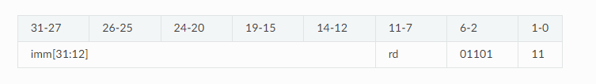
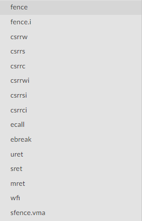

| Лабораторная работа №1 | M3104                   | АОВС |
| ---------------------- |-------------------------| ---- |
| Представление чисел    | Поляк Яков Владимирович | 2024 |

## Что реализовано
Реализован вариант normal, а именно подсчёт LRU, p-LRU и перевод в машинный код
## Результат работы на тестовых данных: https://github.com/skkv-itmo-comp-arch/se-ca24-backlog-cache-isa-Yashi213/actions/runs/11215831881/job/31173809192

# Описание:

### Перевод из C в asm.
Для того чтобы сделать данный перевод, потребовалось ознакомиться с командами, которые поддерживает
данный стандарт. В основе всего использовались следующие команды:

1) addi - кроме обычной суммы, удобное объявление небольших по значению переменных
1) lui - объявление переменных, с большим значением
2) blt - переход по указанному адресу при выполнении условия, что первое переданное значение меньше второго (используется для реализации циклов)
3) srli - сдвиг, использовался потому что lui сдвигал значение на 12 бит
4) lw - загрузка 32-битного слова из памяти в регистр 
5) sw - загрузка 32-битного слова из регистра в память

Примеры использования команд в кокретной ситуации:

lui t0, 0x100 - объявляем указатель на начало массива (в коде это переменная pa) \
srli t0, t0, 12 - сдвигаем на 12 бит в результате чего в t0 лежит 1, указывающая на начало массива a \
Чтобы объявить указатель массива b, надо посчитать сколько места займёт массив a и указателю pb присвоить значение равное  
размеру массива а. \
lui t1, 0x900 \
srli t1, t1, 12 \
С массивом c аналогичная ситуация. \
Подробнее про числа 0x100, 0x900 и 0x1800 в 16-ричной системе. 900 - 100 = 800 (2048 в десятичной) \
именно столько занимает массив а, отсюда указатель pb равный 0x900. Аналогично с массивом с.

addi t3, zero, 0 - объявляем переменную со значением 0 (в регистр t3), можно использовать вариант lui + srli, но addi удобнее, если значение небольшое \
mul a3, t4, a1 - в регистр a3 запишется значение t4 * a1 \
add s3, t1, a4 - в регистр s3 записывается сумма t1 и a4 (одно из применений - итерация по массиву) \
sw/lw - в контексте кода кладём/достаём значение в/из массива\
blt t5, s1, -40 - проверяет условие t5 < s1, если выполняется, происходит перемещение на 10 инструкций назад. С помощью данной команды
реализован цикл

### Перевод в bin
Перебор всех команд и перевод аргументов в машинный код. Сначала переводится в big endian из-за его удобства перевода, ведь 
в данном формате старшие биты стоят слева, что привычнее (нет путаницы при написании кода), 
Затем полученное число переводим в little endian (это требует стандарт), а уже потом в 16-ную систему счисления.

Разберём на примере команды lui rd imm:

Для начала нужно посмотреть правило кодировки данной команды (https://msyksphinz-self.github.io/riscv-isadoc/html/rvi.html#lui)

Согласно данным правилам в первые 12 бит нужно положить число imm, а в биты 11-7 регистр rd, затем сделать побитовое или с числом 55,
равное 0110111, после чего перевести полученное число в 16-чиную систему и мы получаем бинарное представление команды.

Все остальные команды реализуем по тому же алгоритму, смотрим инструкцию и реализуем её. Все переводы реализованы в классе 
AssemblerToCode в функции GetBinFile. 

Чтобы записать файл именно в бинарном виде, потребовалось открыть файл с расширением std::ios::binary, и прежде чем помещать туда команду, 
преобразовать полученной число к типу const char *, чтобы в файл записалось именно бинарное представление числа.

Реализован перевод всех команд RV32i, RV64i, RV32M, RV64M, кроме:

### Параметры системы
ADDR-LEN - логарифм по основанию 2 от MEM-SIZE (в битах) = 19 (Длина адреса)

CACHE-WAY - CACHE-LINE-COUNT / CACHE-SIZE = 4 (кол-во блоков кэш-линий)

CACHE-TAG-LEN = ADDR-LEN - CACHE-OFFSET-LEN - CACHE-INDEX-LEN = 10 БИТ (длина кеш тега, в адресе памяти хранится 19 бит,
из которых 9 занимаю офсет и индекс)

CACHE-LINE-SIZE = 2 ^ CACHE-OFFSET-LEN = 32 БИТ (офсет показывает кол-во бит, на которое мы можем сдвинуться в кеш линии)

CACHE-LINE-COUNT = CACHE-SIZE / CACHE-LINE-SIZE = 64 (кол-во кеш линий)

CACHE-SETS = 2 ^ CACHE-INDEX-LEN = 16 (индекс указывает на кеш сет)

### Кеш
Кэш — это высокоскоростная память, используемая для хранения часто запрашиваемых

Основные действия при работе с кешем можно описать в 3 пунктах:

1. Поиск данных. Процессор просто перебирает теги и в случае совпадении (кеш-хит) данные быстро возвращаются.
2. Кэш-мисс. Случается, когда в кеше не лежат нужные данные, в данном случае процессор просто обращается к более медленной памяти.
3. Замена данных. Нужно положить данные в кеш, а он заполнен, происходит замена данных согласно выбранной политике замещения 
(2 политики описаны ниже)

В моей реализации кеш - массив из структур, которые состоят из tag, time(для LRU) и
flag(Для p-LRU), поля data - нет, так как в данной задаче оно не нужно. Представленная модель кеша показалась мне удобной для работы,
массив схож по своей структуре с кешем, а в структуру входит всё необходимое, tag - для поиска нужных ячеек, time и flag 
нужны для реализации политик вытеснения, ничего лишнего.
Данный массив - поле класса AssemblerToCode. 

LRU - при обращении к памяти вызывалась функция инкремента поля time (поле отвечает, за условное время обращения к памяти)
у всего кеша, после чего при попадании (совпадение тегов) просто увеличивался hit-rate, в случае промаха в кеш сете искалась ячейка с
максимальным значением поля time и уже с данной ячейкой производилась нужная работа.
В обоих случаях обнулялось значение поля time.

p-LRU - упрощённая версия LRU. Вместо точного отслеживания времени использования ячеек, используется древовидная система флагов (true/false в моей реализации).
Данная структура указывает направление, в котором нужно искать наименее недавно использованной ячейки. В случае, когда все
ячейки заняты, значение флагов меняется на противоположное.

В обоих случаях результат попаданий в кеш равен отношению попаданий к общему количеству запросов

### Результат работы
В результате работы выводится 2 значения(или одно, в зависимости от аргументов командной строки), процент попаданий в кеш,
в заданном файле, с разными политиками вытеснения.
Также создаётся файл с бинарником, имя которого равно значению аргумента bin.
