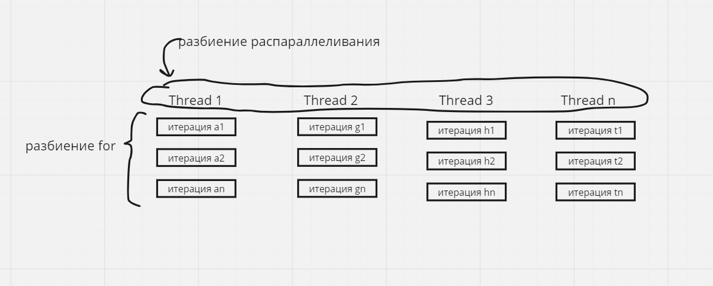
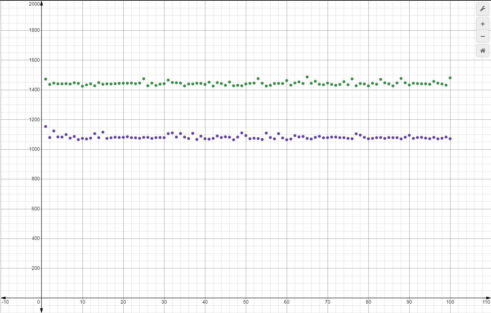
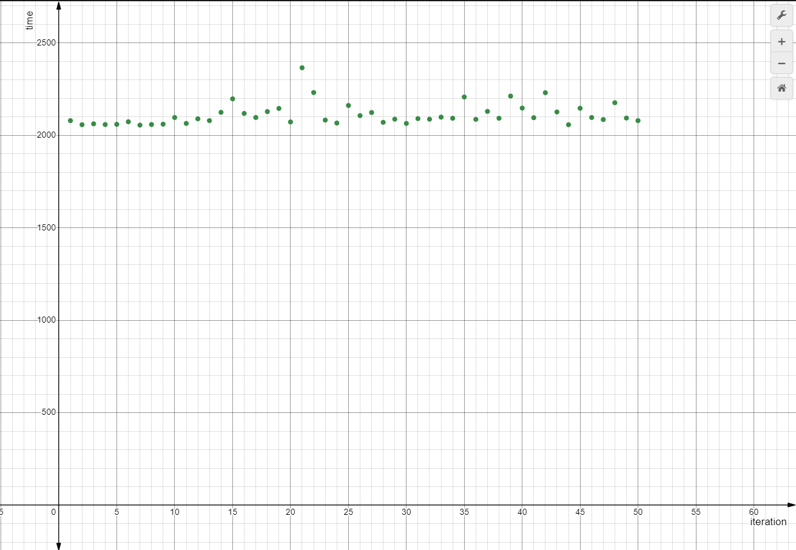
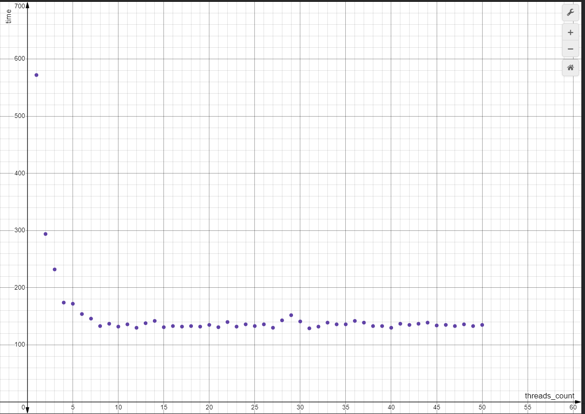
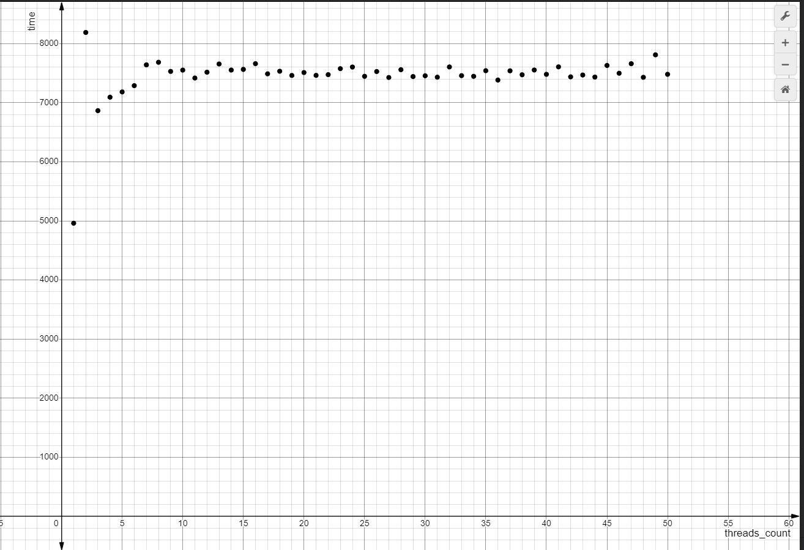
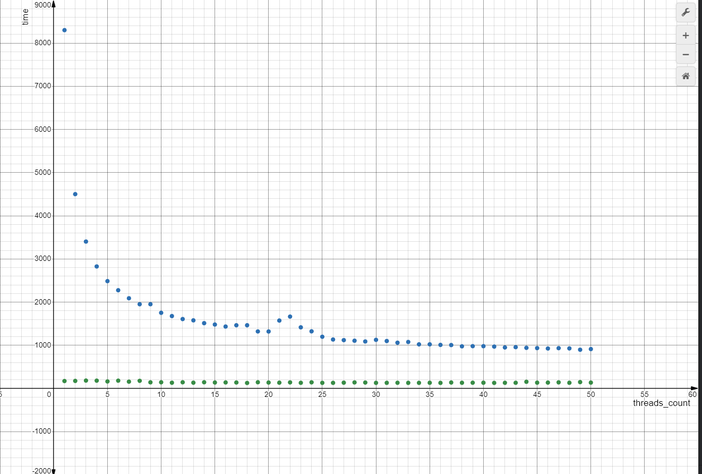
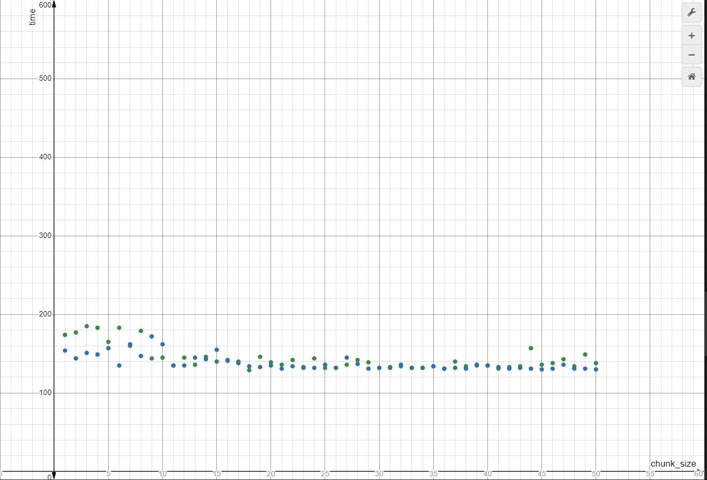
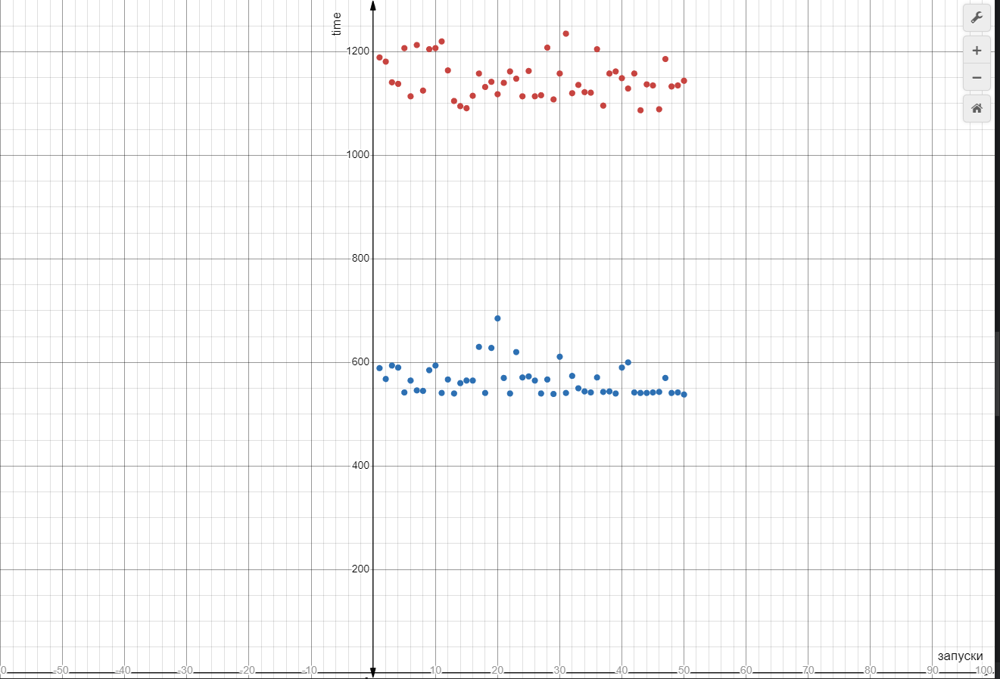
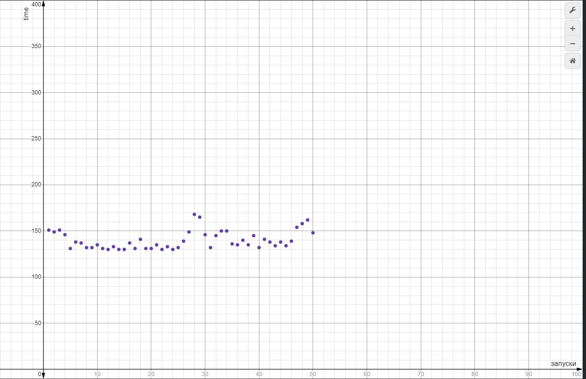

| Лабораторная работа №4 | M3104                   | АОВС |
| ---------------------- |-------------------------| ---- |
| OpenMP                 | Поляк Яков Владимирович | 2024 |

## Инструментарий
С++ 20 стандарт 

Open Mp 2.0

## Что реализовано
Была реализована полная версия проекта, а именно многопоточный подсчёт объёма фигуры, заданной уравнением:

x^4 - a*x^3 + a^2 * (y^2 + z^2) = 0, где параметр a = 2. Объём подсчитывался методом Моте-Карло. Данный метод заключается в том, 
что выбирается случайная точка в пределах куба/параллелепипеда, описывающего фигуру, в случае, если эта точка оказалась в пределах
заданной фигуры увеличивается hit_rate. Итоговый объём равен отношению hit_tate к количеству попыток, умноженное на объём описывающей 
фигуры.

**Модификация**:
Сравнил три типа генерации случайных чисел, а именно ranlux24_base, mt19937 и псевдо рандом, сделанный с помощью операций xor и битового сдвига.

## Результат работы на тестовых данных: [ссылка на последний успешный action с актуальными данными](https://github.com/skkv-itmo-comp-arch/se-ca24-backlog-omp-Yashi213/actions/runs/11216440783)

# Описание:
### Результат работы программы:
В результате работы программы на лучших параметрах(описанно в разделе тестирования) в стандартный поток выводится количество потоков и 
время работы, а в файл записывается найденый объём

Пример:

Стандартный поток: Time (8 threads): 128.999949

Файл: 1.25656

Тестирование производилось на процессоре: Intel(R) Core(TM) i7-7700K CPU @ 4.20GHz   4.20 GHz (эксплуатируется более 4 лет)

### Open mp
Для того чтобы распараллеливать процессы я использовал следующие команды Open Mp:
1. parallel - определяет параллельный блок, который будет распараллеливаться, то есть выполнятся заданным количеством 
потоков
2. for - определяет блок, в котором итерации цикла for будут распределяться между потоками
3. atomic - директива, обеспечивающая атомарность операции (например инкремент, как в описываемом коде), при параллельных процессах. Предотвращает
   race condition. Атомарная операция - операция во время выполнения которой, другие потоки не могут наблюдать за её промежуточным состоянием, при этом
данная директива не блокирует работу потоков.
4. omp_get_max_threads - функция, которая возвращает максимальное число потоков, которое может использоваться в параллельной области
5. omp_get_wtime - возвращает время в миллисекундах, начало отсчёта зависит от операционной системы
6. schedule - используется для управления способом распараллеливания
7. num_threads - используется для явного указания количества потоков (set) / получение количества потоков (get)
8. static - параметр schedule, задающий статическое распределение задач между потоками, в данном случае задача 
это итерация цикла. Все задачи распределяются между потоками до начала выполнения, после чего данное разбиение остаётся неизменным.
9. dynamic - параметр schedule, задающий динамическое распределение задач между потоками. Поток получает задачу или блок задач
(зависит от параметра chunk_size), после выполнения поток запрашивает новую задачу/блок задач. Задачи распределяются по потокам
по мере их завершения.
10. chunk_size - параметр schedule, задающий размер блоков (чанков) итераций, которые назначаются потокам для выполнения
11. #pragma - механизм, с помощью которого, добавляются инструкции компилятору.
12. #pragma omp - инструкция для компилятора, которая указывает, что следующий блок кода надо выполнить с использованием OpenMP.

### Описание кода:
Для реализации распараллеливания процессов я выделил блок кода начинающийся с создания переменной state, отвечающей за 
начальное значение генератора, а в 
блоке for находится сам цикл, где уже генерируются рандомные координаты с помощью операций над переменной state (xor и битовые сдвиги),
затем в 
области atomic в случае попадания hit_rate увеличивается на 1. Перед всем этим инициализируется количество потоков с помощью
num_threads(n), где n = omp_get_max_threads() или n = num_threads (задаётся пользователем). 

После выхода из области parallel считается время работы программы time = end - begin, где:

begin = omp_get_wtime();  (находится до распараллеливания)

end = omp_get_wtime(); (находится после распараллеливания)

Получаем следующую систему:

xor-shift генератор был выбран из-за того, что данный способ является самым быстрым, да, у него есть свои минусы, но в данной 
работе они не так критичны (описано ниже).

Также стоит отметить, что в качестве стандартного числа потоков, я использовал максимальное число потоков процессора.

### Мотивация выбора генераторов:
RANLUX24 Base - данный генератор известен своим высоким качеством случайных чисел, он часто используется в научных работах. 
При этом не отличается высокой скоростью работы.

MT19937 - этот генератор имеет неплохое качество генерации чисел, работает довольно быстро, но из-за сложной структуры генерации 
есть генераторы быстрее.

xor-shift - простой в реализации и наиболее быстрый генератор. В его основе лежат всего две операции, а именно: xor и битовый сдвиг.
Из-за его простоты, данный генератор имеет слабые статистические свойства.

Если всё упростить данный генераторы можно разбить на три уровня:
1. Медленный, генерация на уровне
2. Средний, генерация чуть хуже
3. Быстрый, генератор предсказуемый и слабый

Интересно сравнить их точность и скорость в рамках данной задачи. Нужны ли качественные случайные числа или можно 
обойтись чем-то простым? Насколько быстрее будет работать последний генератор и будет ли вообще быстрее? Данные вопросы сподвигли 
выбрать представленные выше генераторы.

### Тестирование:

Для начала определимся с самым быстрым способом генерировать случайные числа. Для этого проведём тестирование скорости работы
без omp, помимо скорости будем учитывать точность найденного объёма, будем ориентироваться на число 1.256.

На данном графике представлено время работы генератора mt19937 (зелёные точки) и генератора xor-shift (фиолетовые точки)

Третий способ (ranlux24_base) покажу на отдельном графике, из-за долгого времени работы на одном графике всё не поместилось

На графиках отчётливо видно, что генератор xor-shift работает гораздо быстрее других генераторов. При этом точность не теряется, 
во всех 3 случаях объём был примерно равен 1.256 (разница в тысячных). Исходя из этого все следующие запуски будут использовать 
xor-shift генератор. Также стоит упомянуть, что xor-shift (в моей реализации) является псевдослучайным генератором, обладает
предсказуемыми и слабыми статистическими свойствами, но в данной задаче его хватает, так как данные минусы не влияют на точность 
вычислений

### Одинаковый параметр schedule  (без chunk_size), разное количество потоков:
Для выявления лучшего количества потоков, я совершил 10 запусков цикла, перебирающего количество потоков и запускающего подсчёт
с указанным количеством потоков, и усреднил время работы. В результате чего получил следующее:

На данном графике представлена зависимость времени работы программы от количества потоков (static). Отсюда видно, что после 8
потоков время работы почти не меняется и даже становится чуть хуже, следовательно, 8 потоков - оптимальное значение, что совпадает 
с количеством логических процессоров моего оборудования.

Dynamic без явного задания chunk_size - работал странно, имел необъяснимую зависимость. И при этом, при любом количестве 
потоков он работал гораздо медленнее static.

Разница static и dynamic заключается в том, что в static процессы работают синхронно, то есть берут новую "партию" итераций
только после того, как освободятся все потоки. В случае dynamic это не требуется, как только процесс заканчивается, он сразуже 
берёт новую "партию".

### Одинаковое количество потоков - 8, разный параметр schedule (с chunk_size)

На данном графике представлена зависимость времени от chunk_size (зелёные точки - static, синие - dynamic). На графике 
видно, что время работа static не изменилось при явном определении chunk_size, при этом время работы dynamic - сильно улучшилось, 
но всё ещё гораздо медленнее static.

Далее я проверил время работы dynamic на больших значениях chunk_size и получил, что dynamic с большим значение chunk_size
работает примерно, как и static, но запустив программу несколько раз, я выяснил, что static работает стабильнее и всё-таки 
обгоняет dynamic.

Шаг = 1000 (у static шаг 1)

### Сравнение 1 потока и no-omp

красный - no-omp, синий - static на одном потоке

Ox - номер запуска

Oy - время работы

На данном графике видно, что без omp программа работает медленнее, это связанно с тем, что компилятор способен оптимизировать
код с OpenMP и видимо мой процессор работает лучше в параллельном режиме, даже с 1 потоком. 
### Лучшие параметры

При анализе графиков, выяснилось, что лучшая конфигурация - 8 потоков schedule(static). Данная конфигурация 
работает стабильнее dynamic, данная зависимость связана с тем, что в данной задаче все итерации цикла работают за примерно 
одинаковое время, из-за чего dynamic не способен значительно улучшить время работы, это просто лишняя нагрузка.

Среднее время на 50 запусках
